```{r, include = FALSE}
knitr::opts_chunk$set(
  collapse = TRUE,
  comment = "#>",
  message = FALSE,
  warning = FALSE
)
```


## Setup
```{r}
library(workflows)
library(parsnip)
```

Load Libraries:

```{r}
library(tidyclust)
library(tidyverse)
library(tidymodels)
library(mclust)
```


```{r setup_secret, echo = FALSE}
set.seed(822)
```

Load and clean a dataset:

```{r}
data("penguins", package = "modeldata")

penguins <- penguins %>%
  select(bill_length_mm, bill_depth_mm) %>%
  drop_na()


# shuffle rows
penguins <- penguins %>%
  sample_n(nrow(penguins))
```


At the end of this vignette, you will find a brief overview of the GMM algorithm and examples of each GMM model specification.


## `gm_clust` specification in {`tidyclust`}

To specify a GMM model in `tidyclust`, set the value for `num_clusters` and use the TRUE/FALSE parameters to select which model specification to use:

```{r}
gm_clust_spec <- gm_clust(
  num_clusters = 3,
  circular = FALSE,
  zero_covariance = FALSE,
  shared_orientation = TRUE,
  shared_shape = FALSE,
  shared_size = FALSE
)

gm_clust_spec
```

There is currently one engine: `mclust::Mclust` (default) 

## Fitting gm_clust models

After specifying the model specification, we fit the model to data in the usual way:

```{r}
gm_clust_fit <- gm_clust_spec %>%
  fit( ~ bill_length_mm + bill_depth_mm,
       data = penguins
      )

gm_clust_fit %>% 
  summary()
```

We can also extract the standard `tidyclust` summary list:

```{r}
gm_clust_summary <- gm_clust_fit %>% extract_fit_summary()

gm_clust_summary %>% str()
```
## Cluster assignments and centers

The cluster assignments for the training data can be accessed using the `extract_cluster_assignment()` function.

```{r}
gm_clust_fit %>% extract_cluster_assignment()
```


If you have not yet read the `k_means` vignette, we recommend reading that first;
functions that are used in this vignette are explained in more detail there.

### Centroids

The centroids for the fitted clusters can be accessed via  `extract_centroids()`:

```{r}
gm_clust_fit %>% extract_centroids()
```


## Prediction


For GMMs each cluster is modeled as a multivariate normal distribution. This makes prediction easy since we can calculate the probability that each point belongs to each of the fitted clusters. Therefore, it is natural for the `predict()` function to assign new observations to the cluster in which they have the highest probability of belonging to.

```{r}
new_penguin <- tibble(
  bill_length_mm = 40,
  bill_depth_mm = 20
)

gm_clust_fit %>%
  predict(new_penguin)
```


## Gaussian Mixture Model Specifications

```{r}
#| include: false
plot_state <- function(obj) {
  
  data.grid <- expand.grid(bill_length_mm = seq(20, 80, length.out=200), bill_depth_mm = seq(10, 25, length.out=200))
  
  mean1 <- obj$mean1
  mean2 <- obj$mean2
  mean3 <- obj$mean3
  
  sigma1 <- obj$sigma1
  sigma2 <- obj$sigma2
  sigma3 <- obj$sigma3
  
  q.samp1 <- cbind(data.grid, prob = mvtnorm::dmvnorm(data.grid, mean = mean1, sigma = sigma1))
  q.samp2 <- cbind(data.grid, prob = mvtnorm::dmvnorm(data.grid, mean = mean2, sigma = sigma2))
  q.samp3 <- cbind(data.grid, prob = mvtnorm::dmvnorm(data.grid, mean = mean3, sigma = sigma3))
  
  penguins_temp <- penguins %>%
    mutate(p1 = mvtnorm::dmvnorm(cbind(bill_length_mm, bill_depth_mm), mean = mean1, sigma = sigma1),
           p2 = mvtnorm::dmvnorm(cbind(bill_length_mm, bill_depth_mm), mean = mean2, sigma = sigma2),
           p3 = mvtnorm::dmvnorm(cbind(bill_length_mm, bill_depth_mm), mean = mean3, sigma = sigma3),
           class = case_when(p1 > p2 & p1 > p3 ~ "1",
                             p2 > p3 ~ "2",
                             TRUE ~ "3"))
  
  ggplot() + 
      geom_point(aes(x = bill_length_mm, y = bill_depth_mm, color = class), data = penguins_temp) +
      geom_contour(aes(x=bill_length_mm, y=bill_depth_mm, z=prob), data = q.samp1, color = "#F8766D", bins = 5) +
      geom_contour(aes(x=bill_length_mm, y=bill_depth_mm, z=prob), data = q.samp2, color = "#00BA38", bins = 5) +
      geom_contour(aes(x=bill_length_mm, y=bill_depth_mm, z=prob), data = q.samp3, color = "#619CFF", bins = 5) +
    theme_minimal() +
    scale_fill_manual() +
    theme(legend.position = "none")
  
}


get_state <- function(params) {

  list(mean1 = unname(params$mean[,1]),
       mean2 = unname(params$mean[,2]),
       mean3 = unname(params$mean[,3]),
       sigma1 = unname(params$variance$sigma)[,,1],
       sigma2 = unname(params$variance$sigma)[,,2],
       sigma3 = unname(params$variance$sigma)[,,3])
}

```


| Model Name | Circular Clusters? | Zero Covariance? | Shared Orientation? | Shared Shape? | Shared Size? | Example |
|-----------|-----------|-----------|-----------|-----------|-----------|-----------|
| EII | TRUE | -- | -- | -- | TRUE |  |
| VII | TRUE | -- | -- | -- | FALSE |  |
| EEI | FALSE | TRUE | -- | TRUE | TRUE | 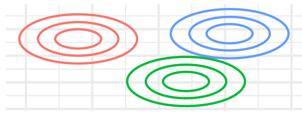 |
| EVI | FALSE | TRUE | -- | FALSE | TRUE | 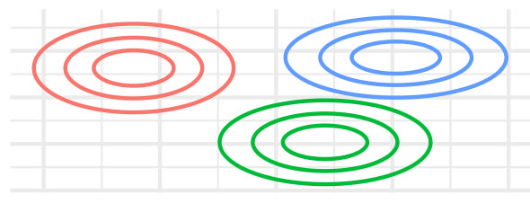 |
| VEI | FALSE | TRUE | -- | TRUE | FALSE | 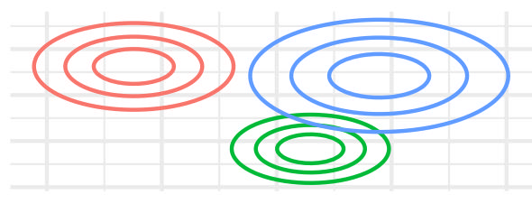 |
| VVI | FALSE | TRUE | -- | FALSE | FALSE | 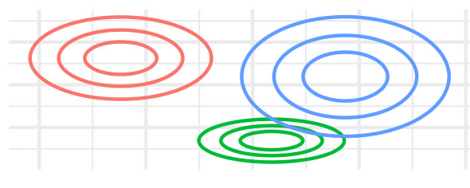 |
| EEE | FALSE | FALSE | TRUE | TRUE | TRUE | 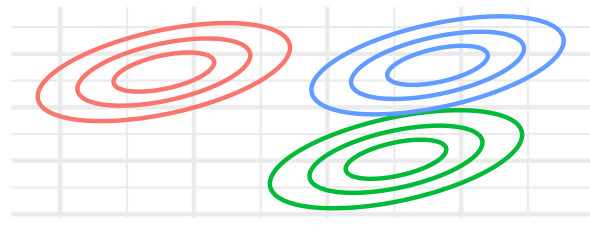 |
| EVE | FALSE | FALSE | TRUE | FALSE | TRUE | 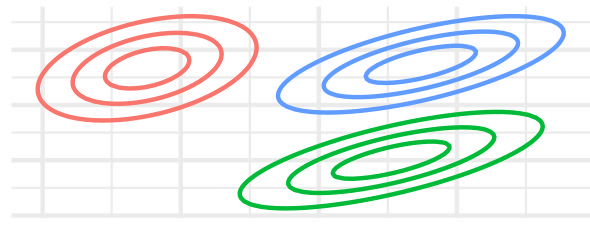 |
| VEE | FALSE | FALSE | TRUE | TRUE | FALSE | 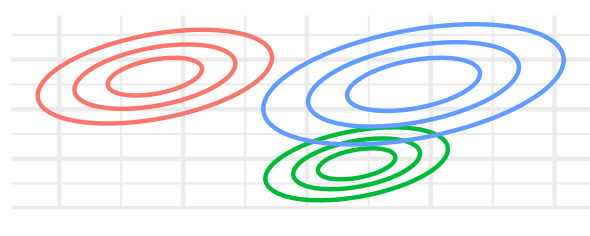 |
| VVE | FALSE | FALSE | TRUE | FALSE | FALSE | 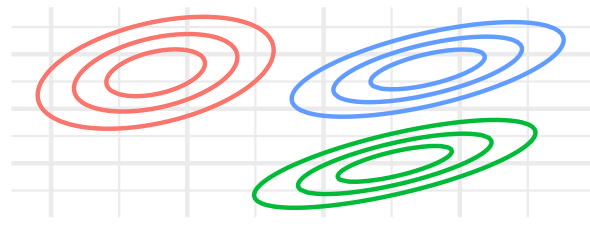 |
| EEV | FALSE | FALSE | FALSE | TRUE | TRUE | 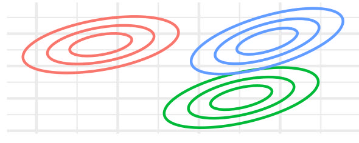 |
| EVV | FALSE | FALSE | FALSE | FALSE | TRUE | 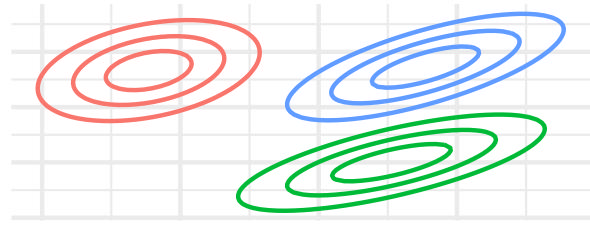 |
| VEV | FALSE | FALSE | FALSE | TRUE | FALSE | 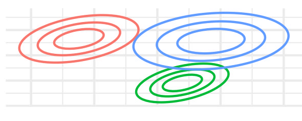 |
| VVV | FALSE | FALSE | FALSE | FALSE | FALSE | 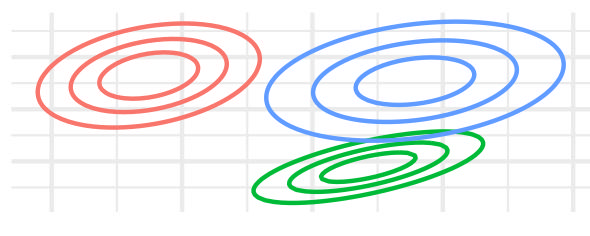 |

: GMM Model Specifications with gm_clust()


## A brief introduction to density-based clustering


Gaussian Mixture Models (GMM) is a probabilistic unsupervised learning method that models data as a mixture of multiple Gaussian distributions. Unlike clustering methods such as k-means, GMM provides a soft clustering approach, where each observation has a probability of belonging to multiple clusters. This allows for more flexibility in capturing complex data distributions.

In GMM, observations are assumed to be generated from a combination of Gaussian distributions, each with some mean vector and variance-covariance matrix. The algorithm works by iteratively estimating these parameters for each cluster using the Expectation-Maximization (EM) algorithm. After estimating these parameters observations are assigned to clusters based on their probability of belonging to each Gaussian component.


```{r}
#| include: false
param_init <- list(
  mean1 = c(45,20), 
  mean2 = c(45, 17.5), 
  mean3 = c(45, 15),
  sigma1 = matrix(c(15,0,0,0.4), nrow = 2, byrow = TRUE),
  sigma2 = matrix(c(15,0,0,0.4), nrow = 2, byrow = TRUE),
  sigma3 = matrix(c(15,0,0,0.4), nrow = 2, byrow = TRUE)
)

param_iter1 <- list(
  mean1 = c(45.73339, 19.27432), 
  mean2 = c(40.12257, 17.81372), 
  mean3 = c(47.44993, 14.93927),
  sigma1 = matrix(c(37.408656, -1.623795, -1.623795, 1.079872), nrow = 2),
  sigma2 = matrix(c(16.9103292, 0.3527712, 0.3527712, 0.8637195), nrow = 2),
  sigma3 = matrix(c(8.093719, 1.797110, 1.797110, 0.874565), nrow = 2)
)

param_iter2 <- list(
  mean1 = c(48.15322, 18.25719), 
  mean2 = c(38.52801, 18.28852), 
  mean3 = c(47.28095, 14.84609),
  sigma1 = matrix(c(17.177953, 1.247011, 1.247011, 1.643133), nrow = 2),
  sigma2 = matrix(c(5.9677874, 0.9537252, 0.9537252, 1.4710272), nrow = 2),
  sigma3 = matrix(c(7.584198, 1.613411, 1.613411, 0.766815), nrow = 2)
)

param_conv <- list(
  mean1 = c(49.17829, 18.46058), 
  mean2 = c(39.0444, 18.3100), 
  mean3 = c(47.69776, 14.98856),
  sigma1 = matrix(c(7.626905, 2.329064, 2.329064, 1.346795), nrow = 2),
  sigma2 = matrix(c(7.837458, 1.077226, 1.077226, 1.477878), nrow = 2),
  sigma3 = matrix(c(10.3399995, 2.3100534, 2.3100534, 0.9769847), nrow = 2)
)
 
```


```{r}
#| echo: false
plot_state(param_init)
```


```{r}
#| echo: false
plot_state(param_iter1)
```


```{r}
#| echo: false
plot_state(param_iter2)
```


```{r}
#| echo: false
plot_state(param_conv)
```


